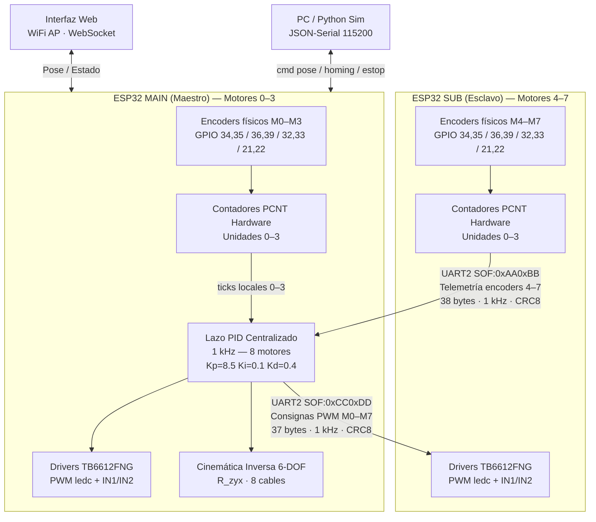

# CDPR — Robot Paralelo Accionado por Cables de 6-DOF
## Arquitectura Simétrica Dual ESP32 · Control GPIO Nativo · Sin Expansor de Pines

[](#)
[](#)
[](https://opensource.org/licenses/MIT)

Este repositorio contiene el firmware definitivo y funcional para un **Robot Paralelo Accionado por Cables (CDPR)** de **8 cables** y **6 grados de libertad** (X, Y, Z, Roll, Pitch, Yaw). La arquitectura de control distribuye la carga de I/O de forma completamente simétrica en **dos módulos ESP32 idénticos** interconectados por UART a alta velocidad, eliminando completamente cualquier necesidad de expansor de pines externo (I2C, SPI, MCP23017 o similar).

---

## 2. Arquitectura General

El sistema emplea dos ESP32 en roles complementarios pero con **hardware idéntico** en cada uno:

- **ESP32 MAIN (Maestro):** Gestiona localmente los **Motores 0–3** (PWM `ledc` + dirección GPIO + encoder `PCNT`). Centraliza el **lazo de control PID a 1 kHz** para los 8 motores. Aloja la interfaz web/WebSocket, la API JSON-Serial para PC y calcula la **cinemática inversa 6-DOF**.
- **ESP32 SUB/ENCODER (Esclavo):** Gestiona localmente los **Motores 4–7** (PWM `ledc` + dirección GPIO + encoder `PCNT`). Recibe las consignas de PWM calculadas por el Maestro y le retransmite el conteo de sus encoders físicos. En `SIMULATION_MODE=1`, integra la dinámica eléctrica del motor DC por software y genera encoders virtuales para pruebas sin hardware.

Ambas placas se interconectan por **UART2 a 921600 bps** con protocolo binario y verificación de integridad **CRC8 Dallas/Maxim**.

> [!IMPORTANT]
> **Control 100% nativo por GPIO:** No se usa ningún expansor de pines I2C (MCP23017 ni equivalente). Todo el control de PWM se realiza con el módulo `ledc` del ESP32 y la lectura de encoders con el periférico de hardware `PCNT` — todo directamente en los pines GPIO de cada placa.

### Diagrama de Flujo de Datos



> [!NOTE]
> En `SIMULATION_MODE=1` (por defecto en `firmware-encoder/platformio.ini`), el ESP32 SUB simula la física del motor DC internamente y genera encoders virtuales, permitiendo validar el lazo de control completo sin conectar ningún motor real.

---

## 3. Tabla Completa de Asignación de Pines

> [!WARNING]
> Ambas placas utilizan **exactamente los mismos números de GPIO** para sus motores locales (son dos chips físicos distintos). Etiquetar físicamente cada placa y cada grupo de cables es **crítico** para evitar cablear los motores a la placa incorrecta.

### Placa 1 — ESP32 MAIN (Maestro) · Motores 0–3

| Motor | PWM (ledc) | IN1 | IN2 | Enc A | Enc B | Unidad PCNT | Nota |
|:------|:----------|:----|:----|:------|:------|:------------|:-----|
| **M0** | GPIO **2** | GPIO 4 | GPIO **15** | GPIO **34** | GPIO **35** | PCNT 0 | GPIO 2 y 15: strapping pins |
| **M1** | GPIO **12** | GPIO 13 | GPIO 14 | GPIO **36** | GPIO **39** | PCNT 1 | GPIO 12: strapping (MTDI) |
| **M2** | GPIO 25 | GPIO 26 | GPIO 27 | GPIO 32 | GPIO 33 | PCNT 2 | GPIO estándar |
| **M3** | GPIO 18 | GPIO 19 | GPIO 23 | GPIO 21 | GPIO 22 | PCNT 3 | GPIO estándar |

### Placa 2 — ESP32 SUB (Esclavo) · Motores 4–7

| Motor | PWM (ledc) | IN1 | IN2 | Enc A | Enc B | Unidad PCNT | Nota |
|:------|:----------|:----|:----|:------|:------|:------------|:-----|
| **M4** | GPIO **2** | GPIO 4 | GPIO **15** | GPIO **34** | GPIO **35** | PCNT 0 | GPIO 2 y 15: strapping pins |
| **M5** | GPIO **12** | GPIO 13 | GPIO 14 | GPIO **36** | GPIO **39** | PCNT 1 | GPIO 12: strapping (MTDI) |
| **M6** | GPIO 25 | GPIO 26 | GPIO 27 | GPIO 32 | GPIO 33 | PCNT 2 | GPIO estándar |
| **M7** | GPIO 18 | GPIO 19 | GPIO 23 | GPIO 21 | GPIO 22 | PCNT 3 | GPIO estándar |

### Pines de Sistema (Idénticos en Ambas Placas)

| Función | GPIO | Dirección | Descripción |
|:--------|:-----|:----------|:------------|
| **STBY local** | **5** | Salida | LOW apaga instantáneamente los 4 canales TB6612FNG locales. Strapping pin — seguro gracias al pull-down interno del TB6612. |
| **UART2 RX** | **16** | Entrada | Recepción del bus de interconexión. Cruzar con TX de la otra placa. |
| **UART2 TX** | **17** | Salida | Transmisión del bus de interconexión. Cruzar con RX de la otra placa. |
| **UART0 TX** | **1** | Salida | Debug / consola serial por USB (UART0). |
| **UART0 RX** | **3** | Entrada | Debug / consola serial por USB (UART0). |

### Notas Críticas sobre Pines Especiales

> [!TIP]
> **Strapping pins (2, 5, 12, 15):** Estos cuatro GPIO determinan el modo de arranque del ESP32. Su uso como salidas de control es seguro en este diseño porque el integrado **TB6612FNG** incorpora resistencias internas de pull-down débil (~200 kΩ) en todos sus pines de entrada (PWM, IN1, IN2, STBY). Esto mantiene las líneas en nivel `LOW` durante el arranque, garantizando el modo de ejecución `SPI Flash Standard` sin componentes de pull-down adicionales en la PCB.

> [!NOTE]
> **Pines input-only (34, 35, 36, 39):** No tienen transistores de salida ni resistencias internas de pull-up/pull-down. Se usan exclusivamente como entradas para los canales A y B de los encoders ópticos de los motores M0/M1 (o M4/M5 en el SUB), donde las señales activas provienen del encoder sin necesidad de pull-up interno.

---

## 4. Protocolo de Comunicación UART

El bus de interconexión opera de forma ininterrumpida a **921600 bps** (`SERIAL_8N1`) sobre `Serial2` en ambas placas (GPIO 16 RX / GPIO 17 TX, **cruzado** entre las dos). El protocolo es **binario compacto** con verificación de integridad por **CRC8 Dallas/Maxim (polinomio reflejado 0x8C)**.

### Trama 1: Telemetría de Encoders `SUB → MAIN` (38 bytes, 1 kHz)

| Bytes | Campo | Valor / Descripción |
|:------|:------|:--------------------|
| 0–1 | `SOF` | `0xAA 0xBB` (Start-Of-Frame) |
| 2 | `LENGTH` | `0x20` (32 bytes de payload) |
| 3 | `SEQ` | Contador circular 0–255 para detección de frames perdidos |
| 4 | `BOOT_ID` | ID pseudoaleatorio (`esp_random()`) generado en cada arranque del SUB para detectar reinicios inesperados |
| 5–36 | `PAYLOAD` | `int32_t[8]` — conteo acumulado de encoders. Índices 0–3 = 0 (remoto), índices 4–7 = conteo físico local de M4–M7 |
| 37 | `CRC8` | CRC8 calculado sobre bytes [3..36] (SEQ + BOOT_ID + PAYLOAD) |

### Trama 2: Consignas de Control `MAIN → SUB` (37 bytes, 1 kHz)

| Bytes | Campo | Valor / Descripción |
|:------|:------|:--------------------|
| 0–1 | `SOF` | `0xCC 0xDD` (Start-Of-Frame) |
| 2 | `LENGTH` | `0x20` (32 bytes de payload) |
| 3 | `SEQ` | Contador circular 0–255 |
| 4–35 | `PAYLOAD` | `float[8]` — PWM con signo de –255.0 a +255.0 para cada motor (calculado por el PID centralizado) |
| 36 | `CRC8` | CRC8 calculado sobre bytes [3..35] (SEQ + PAYLOAD) |

### Timeout de Seguridad Distribuido (ESTOP Autónomo)

Ambas placas implementan su propio watchdog de comunicación de forma **completamente independiente** — ninguna depende de la otra para entrar en modo seguro:

- **ESP32 MAIN:** Si no recibe telemetría válida en más de **50 ms**, entra en `STATE_ESTOP` localmente: tira su `STBY` a `LOW`, fija el target de cada motor en su posición actual y apaga todas las salidas PWM locales (M0–M3).
- **ESP32 SUB:** Si no recibe consignas válidas en más de **50 ms**, desactiva su `STBY` local a `LOW` y apaga PWM + IN1/IN2 de todos sus motores locales (M4–M7) de forma autónoma, sin esperar ninguna orden de la placa MAIN.

---

## 5. Sistema de Control (PID)

El lazo de posición se calcula de forma **centralizada en el ESP32 MAIN** para los **8 motores simultáneamente** a una frecuencia de **1 kHz** en el Core 0 (`controlLoopTask`). El estado combinado —encoders locales leídos por PCNT + encoders remotos recibidos por UART— se fusiona en cada iteración.

### Parámetros del Controlador (definidos en `Config.h`)

| Parámetro | Valor | Descripción |
|:----------|:------|:------------|
| `PID_KP` | **8.5** | Ganancia proporcional |
| `PID_KI` | **0.1** | Ganancia integral |
| `PID_KD` | **0.4** | Ganancia derivativa |
| `PID_INTEGRAL_LIMIT` | **±50.0** | Límite anti-windup (clamp simétrico) |
| `PID_MAX_PWM` | **255** | Límite superior de salida |
| `PID_MIN_PWM` | **–255** | Límite inferior de salida |
| `HOLDING_TORQUE_PWM` | **25** | Pre-tensión mínima aplicada en reposo |

### Lógica de Actuación

- **Torque de retención activo (anti-holgura):** Cuando la señal PID es positiva pero menor que `HOLDING_TORQUE_PWM`, se satura a 25 para mantener tensión mínima en el cable y evitar holguras. Si el error es pequeño (< 50 ticks ≈ 1.5 mm) y la señal sería negativa, también se aplica la pre-tensión positiva.
- **Freno activo (Short-Brake):** Cuando `pwm_output == 0`, ambos pines de dirección (`IN1=LOW`, `IN2=LOW`) generan un cortocircuito dinámico en el devanado del motor para frenado instantáneo.
- **ESTOP por hardware:** En `STATE_ESTOP`, el pin `STBY` se tira a `LOW` en hardware deshabilitando el driver TB6612FNG antes de que cualquier señal de software llegue al motor.

---

## 6. Cinemática Inversa

El modelo cinemático transforma la **pose del efector final** (X, Y, Z, Roll, Pitch, Yaw) en la **longitud de los 8 cables** requerida para alcanzarla:

```
L_i = || P_i - (X_ef + R_zyx * a_i) ||_2
```

Donde:
- `P_i` — Posición de la polea fija i en el marco del mundo (`POLE_POSITIONS`, en centímetros).
- `a_i` — Punto de anclaje en la plataforma móvil (`ANCHOR_POSITIONS`, relativo al centro del efector).
- `R_zyx` — Matriz de rotación intrínseca Rz(yaw) · Ry(pitch) · Rx(roll).

### Parámetros Geométricos (Config.h / kinematics.py)

| Cable | POLE_POSITIONS [cm] | ANCHOR_POSITIONS [cm] |
|:------|:--------------------|:----------------------|
| 0 | (−22.5, −21.0, 45.0) | (−5.0, −4.0, 0.0) |
| 1 | (−21.0, −22.5, 45.0) | (−4.0, −5.0, 0.0) |
| 2 | (+21.0, −22.5, 45.0) | (+4.0, −5.0, 0.0) |
| 3 | (+22.5, −21.0, 45.0) | (+5.0, −4.0, 0.0) |
| 4 | (+22.5, +21.0, 45.0) | (+5.0, +4.0, 0.0) |
| 5 | (+21.0, +22.5, 45.0) | (+4.0, +5.0, 0.0) |
| 6 | (−21.0, +22.5, 45.0) | (−4.0, +5.0, 0.0) |
| 7 | (−22.5, +21.0, 45.0) | (−5.0, +4.0, 0.0) |

**Pose inicial por defecto:** X=0, Y=0, Z=22.5 cm, Roll=0, Pitch=0, Yaw=0.

**Implementaciones del modelo:**
- Firmware C++: `firmware-main/src/Kinematics.cpp` y `Kinematics.h`
- Validación Python: `python-sim/kinematics.py`

---

## 7. Estructura del Repositorio

```
codigo/
├── README.md                      <- Este archivo (fuente de verdad del proyecto)
│
├── firmware-main/                 # Proyecto PlatformIO — ESP32 MAIN (Maestro)
│   ├── platformio.ini             # Plataforma pioarduino 51.03.07, SIMULATION_MODE=0
│   ├── data/                      # Archivos de interfaz web (HTML/CSS/JS) → LittleFS
│   └── src/
│       ├── Config.h               # Pines M0–M3, constantes PID, geometría del robot
│       ├── Kinematics.cpp / .h    # Cinemática inversa 6-DOF (R_zyx, 8 cables)
│       ├── MotorController.cpp    # Lazo PID, torque retención, freno activo, GPIO
│       ├── MotorController.h      # Interfaz pública del controlador de motor
│       ├── Globals.cpp / .h       # Variables de estado global compartidas entre archivos
│       ├── SystemState.h          # Enum de estados: UNHOMED, HOMING, READY, ESTOP
│       ├── WebInterface.h         # Servidor AsyncWeb + WebSocket (telemetría 20 Hz)
│       └── main.cpp               # Setup Core 1, controlLoopTask Core 0 a 1 kHz,
│                                  #   PCNT local, parser UART no bloqueante, JSON-Serial
│
├── firmware-encoder/              # Proyecto PlatformIO — ESP32 SUB (Esclavo)
│   ├── platformio.ini             # Plataforma pioarduino 51.03.07, SIMULATION_MODE=1
│   └── src/
│       ├── Config.h               # Pines M4–M7, constantes de simulación de motor DC
│       └── main.cpp               # encoderTask Core 1 a 1 kHz, PCNT, UART,
│                                  #   GPIO físico M4–M7, simulación DC por software
│
├── python-sim/                    # Scripts Python para validación y visualización en PC
│   ├── kinematics.py              # Espejo Python del modelo cinemático del firmware
│   ├── motor_sim.py               # Simulación dinámica auxiliar del motor DC
│   ├── validation.py              # Test de validación cruzada: Python vs ESP32 via serial
│   └── visualizer.py             # Visualizador gráfico de pose y longitudes de cable
│
└── docs/                          # Documentación técnica adicional
    ├── README.md                  # Copia de referencia de este README
    └── pin_audit_report.md        # Reporte detallado de auditoría de conflictos de pines
```

---

## 8. Cómo Compilar y Flashear

### Requisitos

- **VS Code** con la extensión **PlatformIO IDE** instalada.
- **Plataforma ESP32:** `pioarduino/platform-espressif32` versión `51.03.07` (se descarga automáticamente al compilar).
- **Framework:** Arduino Core para ESP32 (gestionado por PlatformIO).

### Compilar y Flashear el ESP32 MAIN (Maestro)

```bash
# Desde la subcarpeta firmware-main/
cd firmware-main

# Solo compilar (verificar que no hay errores):
pio run

# Compilar y flashear el firmware (placa MAIN conectada por USB):
pio run --target upload

# Subir la interfaz web al sistema de archivos LittleFS:
pio run --target uploadfs

# Monitorear salida serial a 115200 bps:
pio device monitor
```

### Compilar y Flashear el ESP32 SUB (Esclavo)

```bash
# Desde la subcarpeta firmware-encoder/
cd firmware-encoder

# Compilar y flashear (placa SUB conectada por USB):
pio run --target upload

# Monitorear salida serial del SUB:
pio device monitor
```

> [!NOTE]
> Si tienes ambas placas conectadas simultáneamente, especifica el puerto con `--upload-port COMx` para evitar flashear la placa incorrecta.

### Selección de Modo: Físico vs Simulación

| Flag | `SIMULATION_MODE=0` | `SIMULATION_MODE=1` |
|:-----|:--------------------|:--------------------|
| **Encoders SUB** | Leídos desde hardware PCNT físico | Integración numérica de motor DC por software |
| **PWM/Dir SUB** | Aplicados a GPIO físicos + TB6612FNG | No se escribe ningún GPIO de potencia |
| **PCNT MAIN** | Leídos desde hardware PCNT físico | Se usan los ticks virtuales recibidos por UART |
| **Uso recomendado** | Hardware completo conectado | Pruebas de lazo de control sin motores |

Para alternar entre modos, editar en `platformio.ini` del proyecto correspondiente:

```ini
build_flags =
    -DSIMULATION_MODE=0   ; Modo físico real
    ; -DSIMULATION_MODE=1 ; Modo simulación (comentar la línea de arriba)
```

---

## 9. Cómo Correr el Simulador Python

El script `python-sim/validation.py` envía una secuencia de 9 poses de prueba al ESP32 MAIN por JSON-Serial y compara las longitudes de cable calculadas en Python contra las calculadas por el firmware, con tolerancia de 0.01 cm (0.1 mm).

### Requisitos Python

```bash
pip install pyserial
```

### Ejecución

1. Conectar el ESP32 MAIN al PC por USB.
2. Editar la constante `PORT` al inicio de `validation.py` según el puerto asignado:
   ```python
   PORT = 'COM5'   # Windows: 'COMx'  |  Linux/macOS: '/dev/ttyUSB0'
   ```
3. Ejecutar el script desde la carpeta `codigo/`:
   ```bash
   python python-sim/validation.py
   ```
4. El script envía primero un comando de homing y luego itera por las poses de prueba, reportando la diferencia máxima por cable en cada iteración.

> [!TIP]
> Si no hay ningún ESP32 conectado, el script entra en **modo offline** y valida únicamente las matemáticas de `kinematics.py` contra los resultados teóricos, sin requerir hardware.

Otros scripts disponibles:
- `motor_sim.py` — Simulación dinámica autónoma del motor DC con respuesta en bucle abierto.
- `visualizer.py` — Representación gráfica en tiempo real de la pose y longitudes de cable.

---

## 10. Advertencias de Hardware Críticas

> [!CAUTION]
> **GND Común Obligatorio entre Placas:** El bus de interconexión UART opera a 921600 bps. Sin una referencia de tierra compartida entre ambas placas, los niveles lógicos se vuelven indefinidos, causando corrupción permanente de tramas y activación constante del `STATE_ESTOP`. Conectar físicamente los pines `GND` de ambas placas entre sí **antes** de conectar cualquier línea UART.

> [!CAUTION]
> **No Confundir Cableado entre Placas:** Ambas placas usan los mismos números de GPIO para sus motores locales (son dos chips distintos). Un error de cableado puede resultar en un lazo de control cerrado sobre el encoder equivocado. **Etiquetar físicamente cada placa** como `MAIN (M0–M3)` y `SUB (M4–M7)` y marcar cada grupo de cables con colores distintos.

> [!WARNING]
> **Arranque Incremental Seguro — Primera Puesta en Marcha:** Alimentar las placas ESP32 por USB primero, **con la línea de 12V de los motores desconectada**. Verificar en el monitor serial que: (1) ambas placas inicializan sin errores, (2) el MAIN reporta frames de telemetría fluyendo sin caer en ESTOP por timeout, y (3) el contador `dropped_frames` se mantiene bajo o en cero. Solo entonces conectar la alimentación de 12V a los TB6612FNG.

> [!WARNING]
> **UART2 TX/RX Cruzados:** Las líneas UART2 deben ir **cruzadas**: `GPIO 17 (TX)` del MAIN conecta a `GPIO 16 (RX)` del SUB, y `GPIO 16 (RX)` del MAIN conecta a `GPIO 17 (TX)` del SUB. Una conexión directa (no cruzada) resulta en comunicación unidireccional silenciosa y activación inmediata del timeout de ESTOP.

> [!WARNING]
> **Strapping Pins durante el Primer Flasheo:** Los GPIOs 2, 5, 12 y 15 determinan el modo de arranque del ESP32. Si alguno de estos pines está en alto durante el reset (por ejemplo, si el motor o encoder está conectado y activo), el ESP32 puede arrancar en modo incorrecto. Desconectar los drivers durante el primer flasheo.

> [!NOTE]
> **Detección Automática de Reinicio del SUB (BOOT_ID):** El `BOOT_ID` aleatorio incluido en cada trama de telemetría permite al MAIN detectar si el SUB se reinició inesperadamente durante la operación (`STATE_READY`). Ante un cambio de `BOOT_ID`, el MAIN fuerza inmediatamente `STATE_ESTOP` para prevenir pérdida de referencia de posición.

---

## 11. Estado del Proyecto / Roadmap

### Hito Actual ✅

- Arquitectura dual ESP32 completamente definida, compilando sin errores en ambos firmwares.
- Protocolo UART binario con CRC8, BOOT_ID y detección de frames perdidos implementado.
- Lazo PID centralizado a 1 kHz con anti-windup (±50), torque de retención (PWM=25) y freno activo.
- Cinemática inversa 6-DOF (R_zyx) validada cruzando Python contra firmware con tolerancia 0.01 cm.
- `SIMULATION_MODE=1` operativo: lazo cerrado completo validable sin hardware de motores.
- Interfaz web / WebSocket con telemetría a 20 Hz y API JSON-Serial para control desde PC.
- ESTOP distribuido: timeout autónomo de 50 ms en ambas placas sin dependencia entre sí.

### Próximos Pasos 🔜

- Validación hardware en banco con motores DC reales y encoders ópticos físicos.
- Calibración de Kp, Ki, Kd en lazo cerrado real.
- Ajuste de la geometría (POLE_POSITIONS / ANCHOR_POSITIONS) a la estructura física construida.
- Implementación de límites de workspace y detección de singularidades cinemáticas.
- Logging de datos de control a SD card o buffer circular para análisis post-run.

> Para el seguimiento detallado de tareas y decisiones de diseño, ver la carpeta `docs/` y las notas de Obsidian del proyecto.

---

## 12. Licencia

Este proyecto está licenciado bajo la **MIT License** — libre de usar, modificar y distribuir con atribución.

```
MIT License
Copyright (c) 2026 — CDPR Project
```
