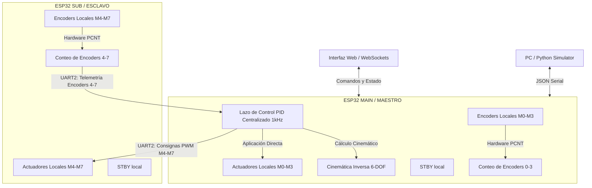

# CDPR - Robot Paralelo Accionado por Cables de 6-DOF
## Arquitectura Simétrica Dual ESP32 (Sin Expansor de Pines)

[](#)
[](https://opensource.org/licenses/MIT)

Este repositorio contiene la arquitectura de control y firmware definitiva para un Robot Paralelo Accionado por Cables (CDPR - Cable-Driven Parallel Robot) de 6 grados de libertad (X, Y, Z, Roll, Pitch, Yaw). La plataforma física emplea 8 cables de tracción independientes accionados por motores DC con encoders ópticos de cuadratura y controladores de potencia TB6612FNG.

La arquitectura de hardware elimina la necesidad de expansores de pines externos (como el MCP23017), distribuyendo la carga de I/O de manera balanceada y simétrica en **dos módulos ESP32 interconectados**.

---

## 2. Arquitectura General

El sistema distribuye el control y la lectura física de forma simétrica entre las dos placas:
*   **ESP32 MAIN (Maestro):** Gestiona los **Motores 0 a 3** (PWM, dirección y encoders) de manera local. Además de su rol local, centraliza el lazo de control PID a 1 kHz, calcula la cinemática inversa y aloja la interfaz web/WebSocket y la API de comunicación JSON Serial para la PC.
*   **ESP32 SUB/ENCODER (Esclavo):** Gestiona los **Motores 4 a 7** (PWM, dirección y encoders) de manera local. Recibe las consignas de PWM desde el Maestro y le transmite el conteo físico de sus encoders a través de una comunicación UART de alta velocidad a 921600 bps.



> [!IMPORTANT]
> **Control 100% Nativo:** Este diseño prescinde por completo de expansores I2C (como el MCP23017) o periféricos externos. Toda la señalización se genera a nivel de registros GPIO nativos utilizando los recursos internos del microcontrolador (módulos de PWM `ledc` y contadores de pulsos `PCNT`).

---

## 3. Tabla Completa de Asignación de Pines

Dado que el diseño es simétrico, ambas placas se conectan eléctricamente a sus respectivos componentes usando la misma matriz de pines. **Es estrictamente recomendable etiquetar físicamente cada placa para evitar confusiones de cableado.**

### Placa 1: ESP32 MAIN (Maestro) - Motores 0 a 3
| Canal Lógico | PWM Pin | IN1 | IN2 | Enc A | Enc B | Unidad PCNT | Notas / Strapping |
| :--- | :--- | :--- | :--- | :--- | :--- | :--- | :--- |
| **Motor 0 (M0)** | GPIO 2 | GPIO 4 | GPIO 15 | GPIO 34 | GPIO 35 | PCNT 0 | GPIO 2 y 15 son Strapping |
| **Motor 1 (M1)** | GPIO 12 | GPIO 13 | GPIO 14 | GPIO 36 | GPIO 39 | PCNT 1 | GPIO 12 es Strapping (MTDI) |
| **Motor 2 (M2)** | GPIO 25 | GPIO 26 | GPIO 27 | GPIO 32 | GPIO 33 | PCNT 2 | GPIO estándar |
| **Motor 3 (M3)** | GPIO 18 | GPIO 19 | GPIO 23 | GPIO 21 | GPIO 22 | PCNT 3 | GPIO estándar |

### Placa 2: ESP32 SUB (Esclavo) - Motores 4 a 7
| Canal Lógico | PWM Pin | IN1 | IN2 | Enc A | Enc B | Unidad PCNT | Notas / Strapping |
| :--- | :--- | :--- | :--- | :--- | :--- | :--- | :--- |
| **Motor 4 (M4)** | GPIO 2 | GPIO 4 | GPIO 15 | GPIO 34 | GPIO 35 | PCNT 0 | GPIO 2 y 15 son Strapping |
| **Motor 5 (M5)** | GPIO 12 | GPIO 13 | GPIO 14 | GPIO 36 | GPIO 39 | PCNT 1 | GPIO 12 es Strapping (MTDI) |
| **Motor 6 (M6)** | GPIO 25 | GPIO 26 | GPIO 27 | GPIO 32 | GPIO 33 | PCNT 2 | GPIO estándar |
| **Motor 7 (M7)** | GPIO 18 | GPIO 19 | GPIO 23 | GPIO 21 | GPIO 22 | PCNT 3 | GPIO estándar |

### Pines de Sistema por Placa:
*   **STBY Local:** `GPIO 5` (Salida digital, una en cada placa. Al ponerse en `LOW` deshabilita de inmediato sus 4 canales de potencia TB6612 locales).
*   **Interconexión UART2:** `GPIO 16` (RX) y `GPIO 17` (TX). *Las líneas deben ir cruzadas (TX de MAIN a RX de SUB y viceversa).*
*   **Depuración/Carga UART0:** `GPIO 1` (TX) y `GPIO 3` (RX), enrutados a través del puerto Micro-USB/USB-C UART de la placa.

### Notas Críticas de Diseño:
> [!TIP]
> **Seguridad de Strapping Pins (2, 5, 12, 15):** Estos pines determinan el modo de arranque del ESP32. Su uso es seguro en este diseño ya que todas las entradas del integrado TB6612FNG (PWM, IN1, IN2, STBY) poseen resistencias internas de pulldown débiles de ~200k. Esto mantiene las señales en nivel `LOW` durante el arranque, asegurando el modo de ejecución SPI estándar de la Flash sin componentes de pull-down adicionales.
>
> **Entradas Restringidas (Input-Only):** Los pines `34, 35, 36 y 39` no tienen transistores de salida y carecen de pull-ups/pull-downs internos. Su uso exclusivo como entradas para los canales de encoders A/B de los motores 0 y 1 (o 4 y 5) es ideal debido a que los encoders ópticos envían pulsos activos definidos externamente.

---

## 4. Protocolo de Comunicación UART

La comunicación binaria de interconexión corre de manera ininterrumpida en Core 1 a 921600 bps. Emplea tramas compactas con verificación de integridad por hardware mediante el polinomio **CRC8 Dallas/Maxim (0x31)**.

### Tipos de Tramas:
1.  **Telemetría de Encoders (SUB -> MAIN, 38 bytes, 1 kHz):**
    *   `SOF 1 & 2`: `0xAA 0xBB`
    *   `LENGTH`: `0x20` (32 bytes)
    *   `SEQ`: Contador circular de secuencia (0-255).
    *   `BOOT_ID`: Identificador pseudoaleatorio generado al iniciar el esclavo para verificar fallos de alimentación remotos.
    *   `PAYLOAD`: `int32_t[8]` con el conteo acumulado de encoders (los índices 4-7 contienen el conteo de M4-M7; los índices 0-3 se transmiten en 0).
    *   `CRC8`: Byte de verificación.
2.  **Consignas de Control (MAIN -> SUB, 37 bytes, 1 kHz):**
    *   `SOF 1 & 2`: `0xCC 0xDD`
    *   `LENGTH`: `0x20` (32 bytes)
    *   `SEQ`: Contador circular.
    *   `PAYLOAD`: `float[8]` con los ciclos de PWM con signo (`-255.0` a `255.0`) calculados por el PID.
    *   `CRC8`: Byte de verificación.

### Timeout de Seguridad Distribuido (ESTOP):
*   Si el **ESP32 MAIN** no recibe telemetría válida por más de **50 ms**, ingresa localmente en `STATE_ESTOP`, apaga sus salidas PWM locales y tira su `STBY` a `LOW`.
*   Si el **ESP32 SUB** no recibe consignas válidas por más de **50 ms**, desactiva localmente su pin `STBY` y apaga todas las salidas de dirección (`IN1`/`IN2`) y PWM a sus motores locales de forma autónoma.

---

## 5. Sistema de Control (PID)

El lazo PID de posición se calcula de forma centralizada en el ESP32 MAIN a **1 kHz**:
*   **Ganancias:** $K_p = 8.5$, $K_i = 0.1$, $K_d = 0.4$.
*   **Anti-Windup:** Límite integral de $\pm 50.0$.
*   **Freno Activo (Short-Brake):** Al detenerse o ante consignas nulas, las señales del driver se ponen en `IN1=LOW` e `IN2=LOW`, forzando el cortocircuito dinámico del motor para frenado instantáneo.
*   **Torque de Retención Activo:** Para eliminar holguras indeseadas en los cables de tracción, el controlador inyecta una pre-tensión constante equivalente a un PWM mínimo de `25` en reposo cerca de la pose objetivo.

---

## 6. Cinemática Inversa

El robot controla la pose del efector final en un espacio de 6 grados de libertad. El modelo cinemático transforma la coordenada del efector $(X, Y, Z, Roll, Pitch, Yaw)$ a la longitud correspondiente de los 8 cables de soporte:
$$L_i = \| \mathbf{P}_i - (\mathbf{X}_{ef} + \mathbf{R}_{zyx} \mathbf{a}_i) \|$$
Donde:
*   $\mathbf{P}_i$ representa las coordenadas del anclaje superior de la polea $i$ (definidas en `POLE_POSITIONS`).
*   $\mathbf{a}_i$ representa el punto de anclaje en el efector final de la plataforma (definidas en `ANCHOR_POSITIONS`).
*   $\mathbf{R}_{zyx}$ es la matriz de rotación del efector final.

El cálculo completo en punto flotante se ejecuta en el procesador Maestro y puede consultarse en [Kinematics.cpp](file:///c:/Users/julio/Desktop/robot%20de%20cables/Cable-Driven%20Parallel%20Robot/codigo/firmware-main/src/Kinematics.cpp).

---

## 7. Estructura del Repositorio

```text
codigo/
├── docs/                         # Documentación del hardware y reportes de auditoría
│   ├── README.md                 # Copia de este README
│   └── pin_audit_report.md       # Reporte detallado de la auditoría de pines original
├── firmware-main/                # Proyecto PlatformIO para el ESP32 Maestro (MAIN)
│   ├── src/
│   │   ├── Config.h              # Mapeo de pines de M0-M3 y configuraciones
│   │   ├── Kinematics.cpp / .h   # Cinemática inversa 6-DOF
│   │   ├── MotorController.cpp   # Control PID y GPIO de motores locales
│   │   ├── Globals.cpp / .h      # Variables de estado global compartidas
│   │   └── main.cpp              # Lazo a 1 kHz, PCNT local y parseador UART
│   ├── platformio.ini            # Configuración de compilación para el Maestro
│   └── data/                     # Archivos de interfaz web (HTML/CSS/JS) para LittleFS
├── firmware-encoder/             # Proyecto PlatformIO para el ESP32 Esclavo (SUB)
│   ├── src/
│   │   ├── Config.h              # Mapeo de pines de M4-M7 locales
│   │   └── main.cpp              # PCNT esclavo, UART y salidas GPIO físicas
│   └── platformio.ini            # Configuración de compilación para el Esclavo
└── python-sim/                   # Scripts de visualización y pruebas de la PC
    ├── validation.py             # Script principal de validación serial JSON
    └── motor_sim.py              # Script auxiliar de prueba y simulación
```

---

## 8. Cómo Compilar y Flashear

### Requisitos:
*   VS Code con la extensión **PlatformIO IDE**.
*   Framework Arduino para ESP32 (Core v3.x o superior).

### Instrucciones de Carga:

1.  **Cargar el ESP32 MAIN (Maestro):**
    *   Conecta la placa MAIN por USB.
    *   Abre la carpeta `firmware-main/` en VS Code.
    *   Compila y carga el firmware:
        ```bash
        pio run --target upload
        ```
    *   Sube la interfaz web al sistema de archivos LittleFS:
        ```bash
        pio run --target uploadfs
        ```
2.  **Cargar el ESP32 SUB (Esclavo):**
    *   Conecta la placa SUB por USB.
    *   Abre la carpeta `firmware-encoder/` en VS Code.
    *   Compila y carga el firmware:
        ```bash
        pio run --target upload
        ```

### Selección de Modo Físico vs Simulación:
En el archivo `Config.h` de ambos proyectos, puedes alterar el comportamiento general alternando el flag `SIMULATION_MODE`:
*   `#define SIMULATION_MODE 0` -> Modo físico real conectado a drivers y encoders.
*   `#define SIMULATION_MODE 1` -> Modo simulación (el ESP32 SUB simula la respuesta inercial del motor DC internamente por software).

---

## 9. Cómo Correr el Simulador Python

El script de validación en Python permite interactuar con el robot enviándole comandos de pose en formato JSON a través del puerto serie USB de la PC conectada al ESP32 Maestro:

1.  Instala las dependencias en la terminal de tu PC:
    ```bash
    pip install pyserial
    ```
2.  Ejecuta el script indicando el puerto COM donde se encuentra el ESP32 MAIN:
    ```bash
    python python-sim/validation.py
    ```

---

## 10. Advertencias de Hardware Críticas

> [!CAUTION]
> **Tierra Común Obligatoria:** El bus de interconexión UART opera a alta frecuencia (921600 bps). Es estrictamente obligatorio conectar físicamente las líneas `GND` de ambos ESP32. La falta de una referencia común provocará la corrupción de datos y activará constantemente el timeout de parada de emergencia (`STATE_ESTOP`).
>
> **Encendido Incremental Seguro:** Durante la primera puesta en marcha, se recomienda alimentar las placas ESP32 por USB y mantener la línea de potencia del motor (VM) apagada. Verifica en el monitor serial que las comunicaciones fluyan sin activar el ESTOP antes de alimentar las etapas de potencia (12V).
>
> **Errores de Conexión Cruzada:** Ambas placas usan internamente la misma numeración de pines GPIO para motores y encoders. Etiqueta físicamente los cables "GRUPO MAIN (M0-M3)" y "GRUPO SUB (M4-M7)" para evitar aplicar señales de control a la placa equivocada.
