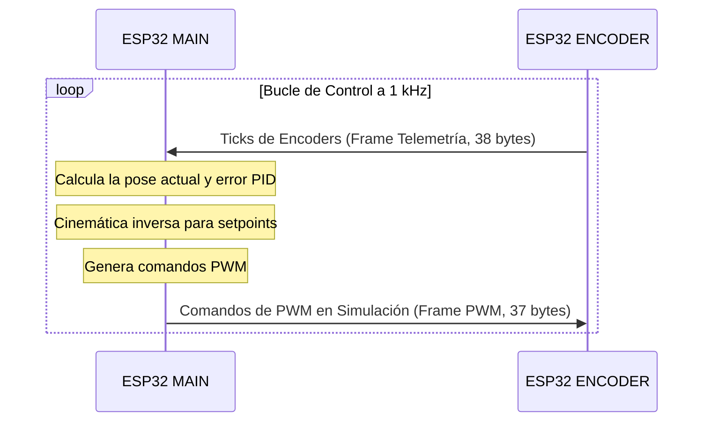

relacionado: [[00 - MOC CDPR]], [[Protocolo UART Binario]], [[Esquema de Conexiones y Pines]], [[Decisiones de Diseño]]
---

# Arquitectura Dual ESP32

## Definición
La arquitectura dual ESP32 distribuye la carga del sistema de control del robot paralelo accionado por cables (CDPR) en dos microcontroladores interconectados a través de un bus UART binario a alta velocidad (921600 bps).

---

## Conceptos Clave
- **ESP32 MAIN (Maestro)**:
  - Ejecuta la cinemática inversa y la planificación de trayectorias.
  - Gestiona el bucle de control PID a 1 kHz.
  - Proporciona conectividad WiFi, WebSocket y servidor web para la interfaz de control.
  - Controla la dirección física de los motores mediante el expansor de E/S MCP23017 por I2C.
- **ESP32 ENCODER (Esclavo)**:
  - Lee los encoders incrementales de los 8 motores en paralelo.
  - Utiliza las unidades periféricas de hardware **PCNT (Pulse Counter)** integradas en el ESP32 para contar los pulsos de cuadratura sin interrumpir la CPU.
  - Transmite periódicamente los conteos acumulados (ticks) al Maestro por UART a 1 kHz.

---

## Medidas de Seguridad del Sistema
1. **Protección de Enlace (Timeout UART)**: Si el Maestro no recibe telemetría del Esclavo durante más de 50 ms, transiciona inmediatamente a `STATE_ESTOP` (Parada de Emergencia) y apaga los controladores por hardware.
2. **Protección contra Reinicios (BOOT_ID)**: El Esclavo genera un identificador aleatorio (`BOOT_ID`) en el arranque. Si este identificador cambia, el Maestro detecta que el Esclavo se ha reiniciado (perdiendo su posición de referencia) y fuerza un `STATE_ESTOP`.
3. **Resincronización de Tramas**: Si se detecta un byte corrupto, el parseador se restablece tras 5 ms de inactividad para evitar bloqueos del lazo de control.

---

## Ejemplos de Flujo de Operación

---

## Enlaces Relacionados
- [[00 - MOC CDPR]]
- [[Robot Paralelo de Cables 6-DOF]]
- [[Protocolo UART Binario]]
- [[Esquema de Conexiones y Pines]]
- [[Decisiones de Diseño]]
